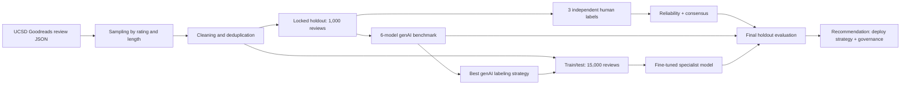

# Technical Appendix Outline

## 1. Pipeline Diagram

## 2. Label Codebook

Use `docs/labeling_codebook.md` and generated `reports/labeling_codebook.pdf`.

## 3. Benchmark Table

| Supplier | Model | Macro F1 | MCC | Alpha vs Human | Runtime | Cost | Parse Failures |
|---|---|---:|---:|---:|---:|---:|---:|
| OpenAI | gpt-4o-mini | TBD | TBD | TBD | TBD | TBD | TBD |
| OpenAI | gpt-4.1-mini | TBD | TBD | TBD | TBD | TBD | TBD |
| Anthropic | claude-3-5-haiku-latest | TBD | TBD | TBD | TBD | TBD | TBD |
| Anthropic | claude-3-7-sonnet-latest | TBD | TBD | TBD | TBD | TBD | TBD |
| Google | gemini-2.0-flash | TBD | TBD | TBD | TBD | TBD | TBD |
| Google | gemini-2.5-pro | TBD | TBD | TBD | TBD | TBD | TBD |

## 4. Fine-Tuning Experiments

| Experiment | Task | Model | Learning Rate | Epochs | Macro F1 | MCC / Sample F1 |
|---|---|---:|---:|---:|---:|---:|
| E1 | emotions | distilroberta-base | 2e-5 | 3 | TBD | TBD |
| E2 | emotions | roberta-base | 2e-5 | 3 | TBD | TBD |
| E3 | commitment | roberta-base | 2e-5 | 3 | TBD | TBD |
| E4 | recommendation | roberta-base | 2e-5 | 3 | TBD | TBD |

## 5. Error Analysis Plan

Analyze false positives and false negatives by:

- Rating level.
- Review length bucket.
- Emotion rarity.
- Mixed-positive/negative reviews.
- Sarcasm and irony.
- Plot-content versus reader-feeling confusion.
- Conditional recommendations.
- Series versus standalone books.

## 6. Mitigation Plan

Likely mitigations:

- Add coder examples for high-confusion labels.
- Tune multi-label emotion thresholds on validation data.
- Use class weights for rare labels.
- Add a human review queue for low-confidence rare emotions.
- Use a genAI escalation path for ambiguous commitment/recommendation cases.

