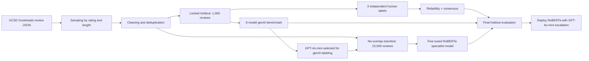

# Technical Appendix

## Pipeline

## Data Files

The final files for modeling are `data/processed/train_no_holdout_overlap.csv`, `data/processed/test_no_holdout_overlap.csv`, and `data/processed/holdout_locked.csv`. The human labels are in `data/labels/holdout_human_labeling_sheet.csv`, and the consensus output is in `data/results/holdout_human_consensus.csv`.

## Human Reliability

| Dimension | Krippendorff Alpha | Percent Full Agreement |
|---|---:|---:|
| Commitment | 0.194 | 39.4% |
| Recommendation | 0.313 | 54.6% |

Emotion agreement varied by label. The lowest alpha was contentment at 0.045, and the highest was none at 0.380. This supports the project’s finding that reader emotions are difficult for humans to align on, especially when reviews express mixed or shifting emotions.

## GenAI Benchmark

| Supplier | Model | Emotion Macro F1 | Commitment Macro F1 | Recommendation Macro F1 | Cost / 1k | Runtime / 1k | Parse Failures |
|---|---|---:|---:|---:|---:|---:|---:|
| OpenAI | GPT-4o-mini | 0.394 | 0.516 | 0.563 | $0.138 | 2,854 sec | 0 |
| OpenAI | GPT-4.1-mini | 0.413 | 0.622 | 0.711 | $0.409 | 2,475 sec | 0 |
| Anthropic | Claude Sonnet 4.6 | 0.411 | 0.618 | 0.757 | $3.913 | 3,754 sec | 2 |
| DeepSeek | DeepSeek Chat | 0.424 | 0.617 | 0.720 | $0.269 | 2,025 sec | 0 |
| Grok | Grok 3 Fast | 0.451 | 0.611 | 0.737 | $0.741 | 1,971 sec | 0 |
| Grok | Grok 4.1 Fast | 0.421 | 0.523 | 0.704 | $0.164 | 8,978 sec | 0 |

GPT-4o-mini was selected as the best overall genAI strategy because it had usable performance, the lowest cost, and no parse failures. Other models scored higher on some individual metrics, but GPT-4o-mini offered the best practical balance for scalable labeling.

## Specialist Model Experiments

| Configuration | Model | Learning Rate | Epochs | Batch Size | Emotion Macro F1 | Commitment Macro F1 | Recommendation Macro F1 |
|---|---|---:|---:|---:|---:|---:|---:|
| 1 | roberta-base | 2e-5 | 3 | 8 | 0.662 | 0.804 | 0.818 |
| 2 | roberta-base | 1e-5 | 5 | 16 | 0.690 | 0.804 | 0.816 |
| 3 | roberta-base | 2e-5 | 5 | 16 | 0.713 | 0.839 | 0.840 |
| 4 | roberta-base | 3e-5 | 10 | 16 | 0.746 | 0.826 | 0.840 |

Configuration 3 was selected because it offered strong F1 scores without the longer training time and overfitting risk of the 10-epoch configuration.

## RoBERTa Holdout Evaluation

| Task | Holdout Macro F1 | Holdout MCC / Sample F1 |
|---|---:|---:|
| Emotions | 0.406 | Sample F1 0.480 |
| Commitment | 0.622 | MCC 0.460 |
| Recommendation | 0.700 | MCC 0.552 |

RoBERTa outperformed GPT-4o-mini on all three holdout tasks: emotions 0.406 vs 0.394, commitment 0.622 vs 0.516, and recommendation 0.700 vs 0.563.

## Error Analysis

The main model weaknesses were rare emotions and overlapping emotional categories. GPT-4o-mini had low F1 for disgust, fear, and anger. Disgust had F1 0.000, fear had F1 0.200, and anger had F1 0.231. The model also over-applied joy, which had very high recall but low precision.

The broader confusion pattern was among joy, love, interest, and contentment. This matches the human reliability issue because those labels are also difficult for people to separate.

## Mitigation Plan

Use RoBERTa for routine production classification and keep GPT-4o-mini as a low-cost genAI labeling and escalation tool. Add more examples for rare labels, clarify codebook rules for joy, love, interest, and contentment, tune multi-label emotion thresholds, and route low-confidence rare-emotion cases to human review.

